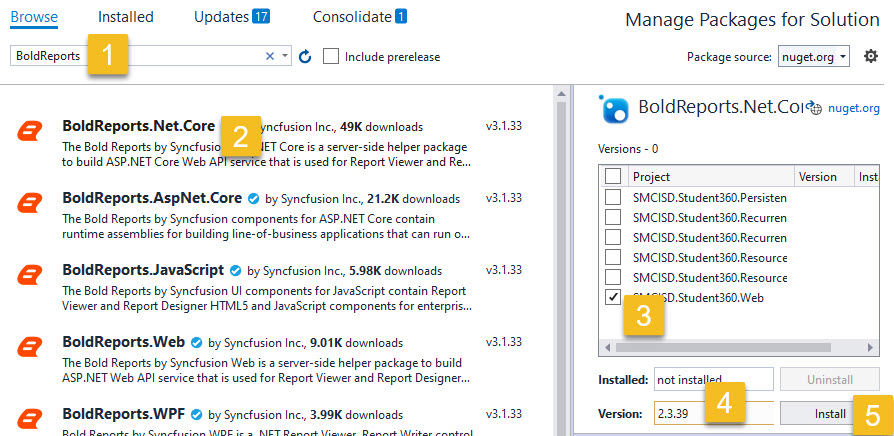

# Restoring BoldReports

BoldReports is an excellent plugin for displaying SQL Server Reporting Services
reports, with substantially better performance and better user interface
integration than alternatives.

However, the [Terms of Use](https://www.boldreports.com/terms-of-use) for
BoldReports states that we cannot redistribute their software. Therefore the
source code available through GitHub cannot be compiled without taking a simple
manual step to install the `BoldReports.Net.Core` plugin into the web application.

If you're comfortable with the command line package manager in Visual Studio,
you can run the following command while connected to the web project:

```powershell
Install-Package BoldReports.Net.Core -Version 2.3.39
```

Or if you are more comfortable with the graphical package manager, then open
that and:

1. Search for "BoldReports"
1. Select `BoldReports.Net.Core`
1. Install into the `SMCISD.Student360.Web` project
1. Select version `2.3.39` (other versions may work, but have not been tested)
1. Click Install.

The solution should now compile.


